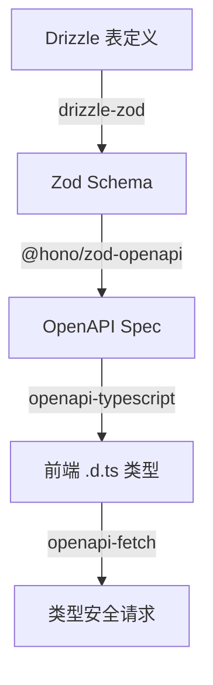

<h1 align="center">
  <a href="https://github.com/NobitaYuan/Full-Stack-template" target="_blank">Full-Stack-Template - 前后端一体化 monorepo 开发模板</a>
</h1>

<p align="center">
  
  
  
  
  
  
</p>

> 集成 Vue3 + Hono 的**主流技术栈和工具链** ⚡
>
> 完整的**前后端类型安全协作链路** 🔗
>
> 内置 **Claude Code AI 辅助开发**，开箱即用 🤖

# ✨ 核心特性

- [x] 🚀 前后端类型全链路安全 — Drizzle → Zod → OpenAPI → 前端类型，一处修改全局感知
- [x] ⚡ 高性能全栈运行时 — Vue 3.5 + Vite 8 + Hono，开发体验与运行性能兼顾
- [x] 🔐 内置认证与权限体系 — JWT + 路由守卫，开箱即用
- [x] 🤖 Claude Code AI 辅助开发 — 一键建模块、智能提交、代码审查
- [x] 📝 工程化规范自动化 — Oxlint + Oxfmt + Husky，提交即格式化
- [x] 📦 现代化 Monorepo 工作流 — pnpm workspace + Turborepo，一键启动全栈

# 📦 架构概览

```
full-stack-template/
├── apps/
│   ├── client/          # @repo/client — Vue 3 + Vite + TDesign
│   └── server/          # @repo/server — Hono + Drizzle ORM + SQLite
├── packages/            # 共享包（预留）
├── turbo.json           # Turborepo 任务编排
├── pnpm-workspace.yaml  # pnpm workspace 配置
└── package.json         # 根 monorepo 配置
```

**前后端类型安全协作链路：**

| 步骤 | 技术 | 功能 | 效果 |
|------|------|------|------|
| 1. 定义数据库表 | Drizzle ORM | 用 TypeScript 声明表结构 | 表结构即代码，类型安全 |
| 2. 生成校验 Schema | drizzle-zod | 从 Drizzle 表自动生成 Zod schema | 单一数据源，表变 schema 自动跟着变 |
| 3. 生成 OpenAPI 规范 | @hono/zod-openapi | 从 Zod schema 自动生成 OpenAPI spec | 路由校验 + API 文档一体化 |
| 4. 同步前端类型 | openapi-typescript | 从 OpenAPI spec 生成前端 `.d.ts` 类型 | 后端改了，前端编译就能发现 |
| 5. 类型安全请求 | openapi-fetch | 带类型的 HTTP 客户端 | 路径、参数、响应全部有类型提示 |



# 🚀 快速开始

```shell
# 克隆仓库
git clone https://github.com/NobitaYuan/Full-Stack-template.git

# 安装依赖
pnpm i

# 生成前端类型（首次启动前必须执行，以后后端改接口后再执行）
pnpm generate:api

# 启动开发服务器（前后端同时启动）
pnpm dev
```

> 环境要求：Node.js >= 18、pnpm

**单独启动：**

```shell
pnpm --filter @repo/client dev    # 仅前端
pnpm --filter @repo/server dev    # 仅后端
```

**构建：**

```shell
pnpm build        # 并行构建前后端
```

**其他命令：**

```shell
pnpm lint         # Oxlint 代码检查
pnpm format       # Oxfmt 格式化
pnpm test         # 运行测试（Vitest）
```

**API 类型同步：**

后端修改 API 后，一键同步前端类型：

```shell
pnpm generate:api
```

如需自定义服务端环境变量（如 JWT 密钥），复制：

```shell
cp apps/server/.env.example apps/server/.env
```

# 🤖 AI 辅助开发

本项目内置 [Claude Code](https://claude.ai/code) 开发配置，包含完整的 CLAUDE.md 规范文档和实用 Skill，AI 开箱即用：

- **CLAUDE.md 三层规范** — 根目录 + 前端 + 后端，涵盖技术栈约定、目录结构、编码规范，AI 读取后自动遵循
- **Skill 技能集** — 封装常用开发流程为一条命令：
  - `/add-module <模块名>` — 一键创建后端模块（建表 → Schema → 路由 → Service → 前端类型生成）
  - `/git-commit` — 智能提交：分析变更、生成结构化 commit message
  - `/simplify` — 代码审查：检查复用性、质量和效率

配合 Claude Code，新增一个完整的增删改查模块只需执行一个 Skill，全程类型安全。

# 📂 项目详情

- **[apps/client/CLAUDE.md](apps/client/CLAUDE.md)** — 前端技术栈、目录结构、开发规范
- **[apps/server/CLAUDE.md](apps/server/CLAUDE.md)** — 后端技术栈、目录结构、API 路由、开发规范

# 📄 License

<a href="https://opensource.org/license/mit/" target="_blank">MIT license.</a>

> Copyright (c) 2026 NobitaYuan
