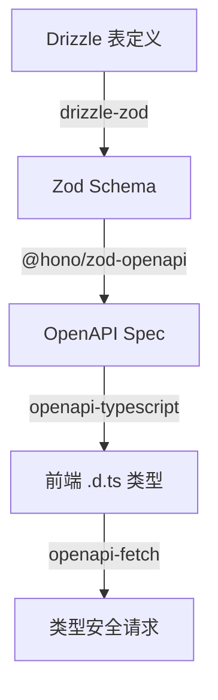

# Full-Stack-Template

前后端一体化 monorepo 开发模板，基于 pnpm workspace + Turborepo。

## 架构概览

```
full-stack-template/
├── apps/
│   ├── client/          # 前端 — Vue 3 + Vite + TDesign
│   └── server/          # 后端 — Hono + Drizzle ORM + SQLite
├── packages/            # 共享包（预留）
├── turbo.json           # Turborepo 任务编排
├── pnpm-workspace.yaml  # pnpm workspace 配置
└── package.json         # 根 monorepo 配置
```

**技术栈**：

| 层 | 技术 |
|---|---|
| 前端 | Vue 3.5 + TypeScript + Vite 8 + TDesign + Pinia + Tailwind CSS |
| 后端 | Hono + TypeScript + Drizzle ORM + better-sqlite3 + @hono/zod-openapi + JWT |
| 工程化 | pnpm workspace + Turborepo + Oxlint + Oxfmt + Husky |
| 类型安全 | OpenAPI spec → openapi-typescript → 前端自动生成类型 |

**前后端协作链路**：

| 步骤 | 技术 | 功能 | 效果 |
|------|------|------|------|
| 1. 定义数据库表 | Drizzle ORM | 用 TypeScript 声明表结构 | 表结构即代码，类型安全 |
| 2. 生成校验 Schema | drizzle-zod | 从 Drizzle 表自动生成 Zod schema | 单一数据源，表变 schema 自动跟着变 |
| 3. 生成 OpenAPI 规范 | @hono/zod-openapi | 从 Zod schema 自动生成 OpenAPI spec | 路由校验 + API 文档一体化 |
| 4. 同步前端类型 | openapi-typescript | 从 OpenAPI spec 生成前端 `.d.ts` 类型 | 后端改了，前端编译就能发现 |
| 5. 类型安全请求 | openapi-fetch | 带类型的 HTTP 客户端 | 路径、参数、响应全部有类型提示 |



## 快速开始

### 环境要求

- Node.js >= 18
- pnpm（必须）

### 安装依赖

```bash
pnpm install
```

### 环境变量

服务端默认配置开箱即用，无需额外配置。如需自定义（如修改 JWT 密钥），复制 `apps/server/.env.example` 为 `.env` 并编辑：

```bash
cp apps/server/.env.example apps/server/.env
```

### 开发

```bash
pnpm dev          # 同时启动前后端开发服务器
```

也可以单独启动：

```bash
pnpm --filter @repo/client dev    # 仅前端
pnpm --filter @repo/server dev    # 仅后端
```

### 构建

```bash
pnpm build        # 并行构建前后端
```

### 其他命令

```bash
pnpm lint         # Oxlint 代码检查
pnpm format       # Oxfmt 格式化
pnpm test         # 运行测试（Vitest）
```

### API 类型同步

后端修改 API 后，一键同步前端类型：

```bash
pnpm generate:api
```

该命令会自动先导出后端 OpenAPI spec，再生成前端 TypeScript 类型。

## AI 辅助开发

本项目内置 [Claude Code](https://claude.ai/code) 开发配置，包含完整的 CLAUDE.md 规范文档和实用 Skill，AI 开箱即用：

- **CLAUDE.md 三层规范** — 根目录 + 前端 + 后端，涵盖技术栈约定、目录结构、编码规范，AI 读取后自动遵循
- **Skill 技能集** — 封装常用开发流程为一条命令：
  - `/add-module <模块名>` — 一键创建后端模块（建表 → Schema → 路由 → Service → 前端类型生成）
  - `/git-commit` — 智能提交：分析变更、生成结构化 commit message
  - `/simplify` — 代码审查：检查复用性、质量和效率

配合 Claude Code，新增一个完整的增删改查模块只需执行一个 Skill，全程类型安全。

## 项目详情

- **[apps/client/CLAUDE.md](apps/client/CLAUDE.md)** — 前端技术栈、目录结构、开发规范
- **[apps/server/CLAUDE.md](apps/server/CLAUDE.md)** — 后端技术栈、目录结构、API 路由、开发规范
