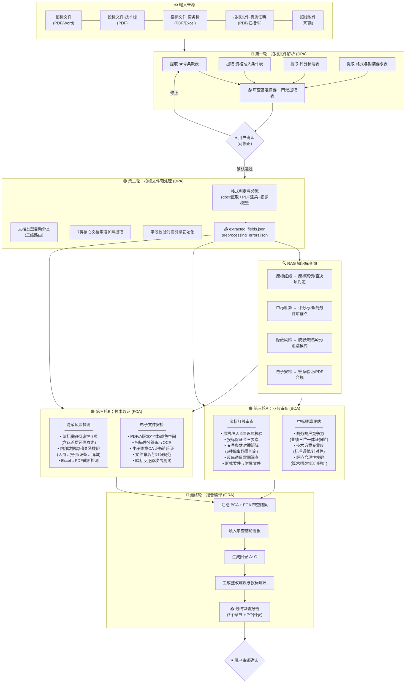
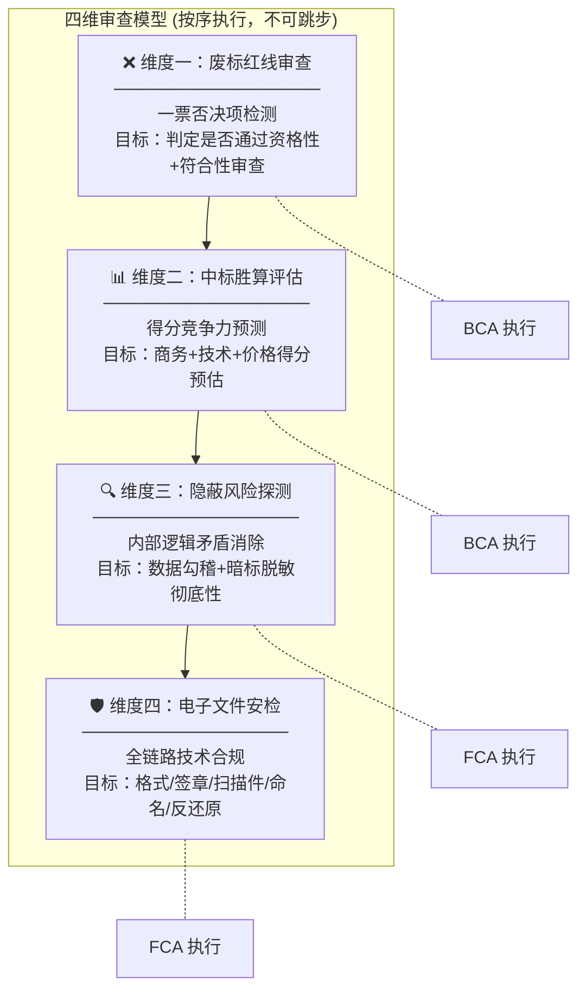

# 标书合规检验审查流程架构图

## 总体架构

```mermaid
flowchart TB
    subgraph inputs["📥 输入来源"]
        I1["招标文件<br/>(PDF/Word)"] --- I2["投标文件·技术标<br/>(PDF)"] --- I3["投标文件·商务标<br/>(PDF/Excel)"] --- I4["投标文件·资质证明<br/>(PDF/扫描件)"] --- I5["招标附件<br/>(可选)"]
    end

    subgraph r1["🔵 第一轮：招标文件解析 (DPA)"]
        R1A["提取 ★号条款表"]
        R1B["提取 资格准入条件表"]
        R1C["提取 评分标准表"]
        R1D["提取 格式与封装要求表"]
        R1OUT["📤 审查基准摘要 + 四张提取表"]
    end

    R1GATE{"⏸ 用户确认<br/>(可修正)"}

    subgraph r2["🟢 第二轮：投标文件预处理 (DPA)"]
        R2A["格式判定与分流<br/>(docx直取 / PDF渲染+视觉模型)"]
        R2B["文档类型自动分类<br/>(三级路由)"]
        R2C["7类核心文档字段护照提取"]
        R2D["字段校验对撞引擎初始化"]
        R2OUT["📤 extracted_fields.json<br/>preprocessing_errors.json"]
    end

    subgraph rag["🔍 RAG 知识库查询"]
        RAG1["废标红线 → 废标案例/否决项判定"]
        RAG2["中标胜算 → 评分标准/商务评审锚点"]
        RAG3["隐蔽风险 → 脱敏失败案例/泄漏模式"]
        RAG4["电子安检 → 签章验证/PDF合规"]
    end

    subgraph r3a["🟠 第三轮A：业务审查 (BCA)"]
        direction TB
        BCA1["废标红线审查<br/>──────────<br/>• 资格准入 9项逐项核验<br/>• 投标保证金三要素<br/>• ★号条款对撞矩阵<br/>  (5种偏离场景判定)<br/>• 反串通反雷同筛查<br/>• 形式要件与附属文件"]
        BCA2["中标胜算评估<br/>──────────<br/>• 商务响应竞争力<br/>  (业绩三位一体证据链)<br/>• 技术方案专业度<br/>  (标准遵循/针对性)<br/>• 经济合理性校验<br/>  (算术/异常低价/限价)"]
    end

    subgraph r3b["🟠 第三轮B：技术取证 (FCA)"]
        direction TB
        FCA1["隐蔽风险探测<br/>──────────<br/>• 暗标脱敏彻底性 7项<br/>  (含遮盖层还原攻击)<br/>• 内部数据勾稽关系核验<br/>  (人员↔报价/设备↔清单)<br/>• Excel→PDF截断检测"]
        FCA2["电子文件安检<br/>──────────<br/>• PDF/A版本/字体/颜色空间<br/>• 扫描件分辨率与OCR<br/>• 电子签章CA证书链验证<br/>• 文件命名与组织规范<br/>• 暗标反还原攻击测试"]
    end

    subgraph r4["🔴 最终轮：报告编译 (ORA)"]
        R4A["汇总 BCA + FCA 审查结果"]
        R4B["填入审查结论看板"]
        R4C["生成附录 A~G"]
        R4D["生成整改建议与投标建议"]
        R4OUT["📤 最终审查报告<br/>(7个章节 + 7个附录)"]
    end

    R4GATE{"⏸ 用户审阅确认"}

    %% 连线
    inputs --> r1
    R1A & R1B & R1C & R1D --> R1OUT
    R1OUT --> R1GATE
    R1GATE -- "确认通过" --> r2
    R1GATE -- "修正" --> R1A

    r2 --> R2OUT
    R2OUT --> rag
    R2OUT --> r3a & r3b
    rag --> r3a & r3b

    r3a --> R4A
    r3b --> R4A
    R4A --> R4B --> R4C --> R4D --> R4OUT
    R4OUT --> R4GATE
```

## 各轮产物一览

```mermaid
flowchart LR
    subgraph 第一轮["第一轮 · DPA"]
        direction TB
        P1A["📄 审查基准摘要"]
        P1B["📋 ★号条款表"]
        P1C["📋 资格准入条件表"]
        P1D["📋 评分标准表"]
        P1E["📋 格式与封装要求表"]
    end

    subgraph 第二轮["第二轮 · DPA"]
        direction TB
        P2A["📦 extracted_fields.json"]
        P2B["📦 preprocessing_errors.json"]
    end

    subgraph 第三轮["第三轮 · BCA + FCA 并行"]
        direction TB
        P3A["BCA: 废标红线判定结果"]
        P3B["BCA: 中标胜算得分预测"]
        P3C["BCA: 价格分析报告"]
        P3D["FCA: 暗标还原攻击报告"]
        P3E["FCA: 数据勾稽核验结果"]
        P3F["FCA: 电子签章验证详情"]
        P3G["FCA: 文件格式合规报告"]
    end

    subgraph 最终轮["最终轮 · ORA"]
        direction TB
        P4A["📑 项目概况与审查摘要"]
        P4B["📑 废标红线审查"]
        P4C["📑 中标胜算评估"]
        P4D["📑 隐蔽风险探测"]
        P4E["📑 电子文件安检"]
        P4F["📑 整改建议与投标建议"]
        P4G["📑 线下人工复核事项"]
        P4H["📑 附录 A~G"]
    end

    第一轮 -- "用户确认后" --> 第二轮
    第二轮 -- "RAG补充后" --> 第三轮
    第三轮 --> 最终轮
```

## 四维审查模型

```mermaid
flowchart TB
    subgraph model["四维审查模型 (按序执行，不可跳步)"]
        direction TB
        D1["❌ 维度一：废标红线审查<br/>─────────────────<br/>一票否决项检测<br/>目标：判定是否通过资格性+符合性审查"]
        D2["📊 维度二：中标胜算评估<br/>─────────────────<br/>得分竞争力预测<br/>目标：商务+技术+价格得分预估"]
        D3["🔍 维度三：隐蔽风险探测<br/>─────────────────<br/>内部逻辑矛盾消除<br/>目标：数据勾稽+暗标脱敏彻底性"]
        D4["🛡️ 维度四：电子文件安检<br/>─────────────────<br/>全链路技术合规<br/>目标：格式/签章/扫描件/命名/反还原"]
    end

    D1 --> D2 --> D3 --> D4

    D1 -.- A1["BCA 执行"]
    D2 -.- A2["BCA 执行"]
    D3 -.- A3["FCA 执行"]
    D4 -.- A4["FCA 执行"]
```
